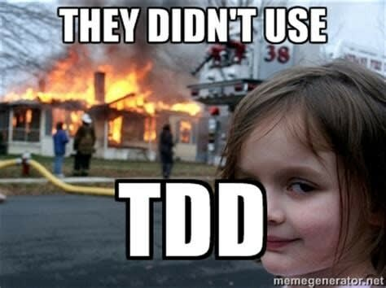
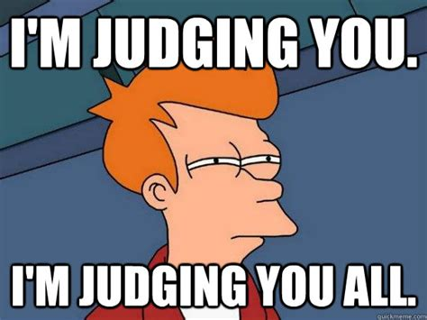

# Task Bunny Api

# TDD in Spring Part 1
## What is TDD

“Test-driven development” refers to a style of programming in which three activities are tightly interwoven: coding, testing (in the form of writing unit tests) and design ( in the form of refactoring)

**Refactoring** -  the process of restructuring computer code without changing or adding to its external behavior and functionality.

**Unit Test** -  the smallest piece of code that can be logically isolated in a system. In most programming languages, that’s a function, sub-routine or method.

## The TDD Process
* Write a test
* Run a test and see if it fails (Yay Failure!!)
* Write code
* Run the tests again (Hopefully it passes)
* Rewrite / Refactor code to make it more efficient
* Run Test again to make sure you didn’t break anything.

[For more on TDD][1]  

## F.I.R.S.T

The first acronym is used to make sure that the test we write are following the best practices.

* **F**ast - test should pass or fail quickly
* **I**ndependent -no tests should depend on another test, no class should depend on another class, or external service.
* **R**epeatable - run N times , get the same result N times ( to help isolate bugs and enable automation)
* **S**elf-checking: test can automatically detect if they pass or fail. Test should come to one binary conclusion. Yes or No.
* **T**imely - written about the same time as our code. (This won’t be a problem because we are writing them before we write our code.)

## S.O.L.I.D

* **S**olid - Single responsibility - A program / module / class / method / test should do one thing, and do one thing well.
* **O**pen-Closed - A program / module / class / method / test should be open for extention but closed to modification.
* **L**iskov Substitution - If Object S is a subtype of T, then objects of type T in a program may be replaced with objects of type S without altering any of the desirable properties of that program.
* **I**nterface Segregation - Clients should not be forced to depend on methods that they do not use.
* **D**ependency Inversion - High-level modules should not depend on low-level modules. Both should depend on the abstraction. ( In this case the abstraction is the interface)

## How To Judge Code

One of the most important skills to develop as a engineer, is to be able to consistantly identify what is good or bad code. The way's that we judge if code is crap, is using design patterns, and design principles.

* F.I.R.S.T.
* S.O.L.I.D.
* 12 Factor Design

These principles should be the bedrock you use to read / design / and judge not only your code, but any code you choose to use in the future.

Any thing you find that isn't accompanied with approrate UNIT Test, should not be trusted.

## What is an Object

At this point you should all know the 3 parts of every object.

* **Id** - its unique space in memory
* **State** - the values that it holds
* **Behavior** - the things you can ask it to do.

I can not overstate how important it is to have this in the back of your head. Everything program is all about creating objects, or collections of objects, and passing those objects around.

## What is RESTful

REST - stands for **Re**presentational **S**tate **T**ransfer.

The keyword here being of course **STATE**, a RESTful system at its core is going to allow external programs to make request to **C**read/**R**ead/**U**pdate/**D**elete an object, or a set of objects safely. 

Things to note here is that the unique place in memory that an object inhabits will be different from program to program, so passing it's **ID** is pointless. 

> Do not confuse an Objects ID with a variable in it's state which could also be called ID.

Also its important to note Objects will behave differently in different applications, so the passing of Behaviors is also excluded from the RESTful process. 

Think of it like this the way you behave at home , is different than the way you would behave at work. ( OR Atleast it SHOULD BE!!)

So the only logical thing that a RESTful application should be passing to an external system is information about the state of a single object or a collection of objects.

## CRUD

The acroynm that we use to describe the expected behavior of a RESTful application is C.R.U.D.

* **C**reate an object or collection of objects
* **R**ead the state of an object or collection of objects
* **U**pdate the state of an object of collection of objects
* **D**elete the an object of collection of objects

###"Data is the new oil" (c) Clive Humbly, British Mathematician 

Data is the most important asset , and it should be protected, so as our programs become more sophsticated we will add logic to create permissions around who can CRUD what and when.

For right now, we will just leave our API's open. 

> Like Future : For the streets

### APIs- Application Program Interface

## HTTP Methods

HTTP stands for, Hyper Text Transfer Protocol. There are a number of transfer protocols available on the internet.

* HTTP
* HTTPS
* UDP
* SMTP
* FTP
* SFTP
* (many more)

For now we will focus on HTTP

| HTTP Verb | CRUD | Entire Collection | Individual Item |
|-----------|:----:|:-----------------:| ---------------:|
| POST      | Create |201 (Created)|404 (Not Found), 409 (Conflict)|
|GET|Read| 200(ok)|200 (ok), 404 (Not Found)|
|PUT|Update/Replace| 405(Method Not Allowed) |200 (Ok) or 204 (No Content) , 404 (Not Found) |
| Delete | Delete| 405 (Method Not Allowed) |200 (Ok) or 204 (No Content) , 404 (Not Found)|
	
## UML

UML - short for Unified Modeling Language, is a standardized modeling language consisting of an integrated set of diagrams, developed to help system and software developers for specifying, visualizing, constructing, and documenting the artifacts of software systems, as well as for business modeling and other non-software systems.

### Types of UML

* Class 
* Component
* Deployment
* Object
* Package
* Sequence

We will be focusing on Class diagrams. Before you write any code to truly master the art of TDD, you must have a plan. Once you have your requirements, the next step is to model out your solution. This is done via UML Class Diagrams.

| Symbol | Meaning |
| :------: | :-------: |
|  | Default |
| +       | Public |
| - | Private |
| #| Protected |
| _ | Constructor |
| < > | Interface |

## Let's build a Task Bunny Api

We are going to build out a task assigning api in Spring Boot, and then create a Client Application in React.

The starter objects that we will be passing back and forth are as follows :

* TaskBunny
* Task
* Group Task

It will help in your engineering process if you follow these steps before coding:

>**Stubbing** - Laying out the non functional structure 

* **Planning** - Model out your solution using UML, this will be very helpful when it comes time to write your test.
* **Testing and Stubbing** - Look at all of the PUBLIC methods in your models, stubbing out the classes, and then creating the test which will fail.
* **Implementation** - replace the stub code with functional code that will make the test pass.
* **Refactor** - clean up your code to make it more effective, and run the unit test to make sure nothing is broken.

### Planning Phase

Do one thing and do it well! Let's not try and build the whole application in one shot, let't use a iterative process and build out our modules one at a time. 

Let's start with the TaskBunny Module.

Let's think about what our TaskBunny Model should look like.

> **Model** - abstraction of a buisness object.

Wach TaskBunny should have the following :

* Id 
	* A unique identifier for the user, not to be confused with the objects unique place in a memory.
* First Name
* Last Name
* Email address
* Date Of Birth

